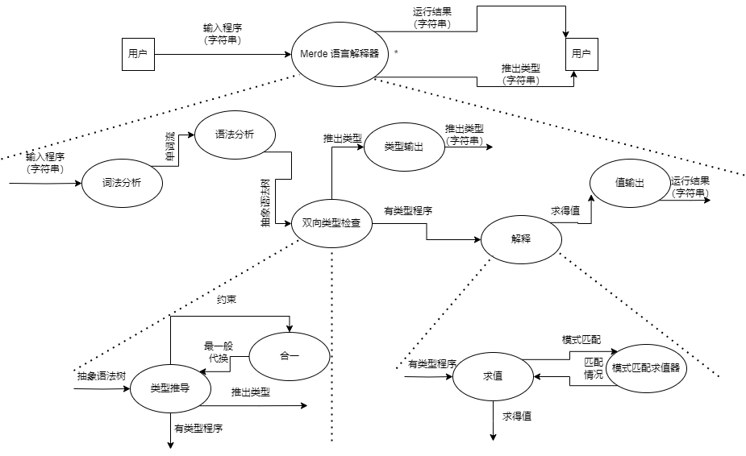
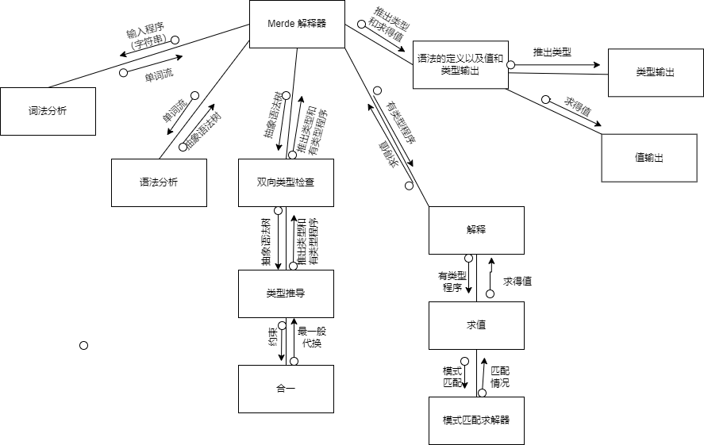

## 1 引言
### 1.1 编写目的
本文档的目的为制定软件详细的需求规格说明，以支持项目的后续开发。

本文档的主要预期读者为项目组开发人员，以及期望对软件做出贡献者。

### 1.2 背景
这里待开发的软件系统名为可扩展函数式程序设计语言 Merde。

本项目为湛忠胜所提出，开发者为湛忠胜、叶文、郭明昊。该软件在个人笔记本电脑上实现。

### 1.3 定义
- EDSL（Embedded Domain Specific Language）：即嵌入式领域特定语言，是指将一种领域特定语言嵌入到另一种语言中的技术。
- REPL（Read-Eval-Print Loop）：是一种简明清晰的交互式编程环境。意即不断读入用户输入（read），求值（eval），然后将结果实时反馈（print）给用户的一个循环过程（loop）。

### 1.4 参考资料
1. 软件需求说明书

## 2 总体设计
### 2.1 需求规定
下面只复述大体的功能需求，详尽的需求规定见参考文献1《软件需求说明书》第3节。
1. 语言层面支持可扩展函数式编程特性
2. 类型系统中要能对可扩展函数式编程建模
3. 类型系统中要能支持基本的泛型（let polymorphism）
4. 类型推导输出的类型必须是用户输入能对应的**最优**类型
5. 输出的求值结果反映用户的要求
6. 对于用户输入程序有错误的情况，要返回详尽的错误信息

### 2.2 运行环境
见参考文献1《软件需求说明书》第4节。

### 2.3 基本设计概念和处理流程


### 2.4 结构

#### 词法分析（Lexer）

词法分析阶段是编译过程的第一个阶段。将源代码转换为一系列标记（tokens），每个标记代表一个独立的语法单元。

这个阶段的任务是读入源程序，即对构成源程序的字符流进行扫描然后根据构词规则识别单词(也称单词符号或符号)。词法分析程序可以使用lex等工具自动生成。

- 删除注释和空格
- 标识关键字、符号、标识符等

#### 语法分析（Parser）

语法分析是编译过程的一个逻辑阶段。语法分析的任务是在词法分析的基础上将单词序列组合成各类语法短语，如“程序”，“语句”，“表达式”等等。语法分析程序判断源程序在结构上是否正确，源程序的结构由上下文无关文法描述。

- 确定语法规则
- 判断是否遵循语法规则
- 构建 AST

#### 双向类型检查（Reconstruction）

通过分析代码，确定表达式和变量的数据类型。该模块通常包括以下功能：

- 推导表达式的类型
- 检查变量之间的类型一致性
- 错误类型检测和报告

#### 解释模块（Interpret）

将 AST 转换为可执行的代码，并创建解释器来执行它们。

- 遍历 AST 并执行相应的操作
- 实现内置函数
- 管理变量和作用域

#### 语法的定义以及值和类型输出（Syntax）
这个模块中提供一些表示语法定义的类型，以及将值和类型转为字符串（以输出给用户）的方法。

### 2.5 功能需求与程序的关系
功能需求编号对应的功能需求见2.1节。
|          | 词法分析 | 语法分析 | 双向类型检查 | 解释模块 | 语法的定义以及值和类型输出 |
| -------- | ------- | ------- | ----------- | -------- | ----------------------- |
| 功能需求1 |         |         |             | √        | √ |
| 功能需求2 |         |         | √           |          | √ |
| 功能需求3 |         |         | √           |          | √ |
| 功能需求4 |         |         | √           |          |   |
| 功能需求5 |         |         |             | √        |   |
| 功能需求6 | √       | √       | √           | √        | √ |

### 2.6 人工处理过程
暂无。

### 2.7 尚未解决的问题
暂无。

## 3 接口设计
### 3.1 用户接口
用户接口为命令行界面，通过 REPL 式的接口与用户交互。用户输入的内容为命令，解释器返回求得值后用户可以继续输入下一命令。接下来我们使用形式化说明的技术，给出语言的语法、操作语义、类型系统定义和类型规则，从而较为精确的表述软件的用户接口输入和输出之规范。

#### 语法
我们先给出语法的EBNF表示（实际程序交给语法分析生成器的代码还要能附加上代码位置的信息，词法分析对象会用到正则表达式来表示）：
```ebnf
comment = "//(_ # '\n')*\n"
binop = "+" | "-" | "*" | "/" | "<" | "="
id = "['_' 'a'-'z' 'A'-'Z']['_' 'a'-'z' 'A'-'Z' '0'-'9']*"
number = "['0'-'9']+"

set_comma_list = id "=" term
               | id "=" term "," set_comma_list

simple_term = id
            | number
            | "true" | "false"
            | simple_expr "." id
            | "{}"
            | "{" set_comma_list "}"
            | "{" set_comma_list "|" term "}"
            | "(" term ")"

app_term = simple_term
         | app_term simple_term

arg_list = id | id arg_list

term = app_term
     | term binop term
     | "if" term "then" term "else" term
     | "fun" arg_list "=>" term
     | "fix" id "=>" term
     | "let" id "=" term "in" term

toplevel = term ";;"
         | "let" id "=" term ";;"
         | "#q" ";;"
```
以上语法涉及的中缀运算符结合性以及优先级从高到底分别为：
1. in（非结合）
2. =>（非结合）
3. else（非结合）
4. =, <（非结合）
5. +, -（左结合）
6. *, /（左结合）

上述语法定义中，`comment`表示单行注释（会被直接忽略），`binop`表示二元运算符，`id`表示标识符，`number`表示数字字面量，`term`表示 Merde 语言表达式（这里分出`app_term`和`simple_term`只是为了分清优先级避免混淆）。用户给解释器输入的命令也即`toplevel`，其第一种情况表示对一个表达式求值，第二种情况不仅要求值还要将之绑定到一个全局的变量上，最后一种情况即退出解释器。

实践中，我们只以`;;`为一条命令结束的标准，因此用户的命令直到`;;`前可以任意换行。
#### 操作语义
为了方便书写，下面将形如`fun x => t`的表达式写成$\lambda x.t$，将`fix s => t`写成$\mu s.t$。

我们首先规定语言中的值$v$的概念。$v$可以是数字字面量（`number`），也可以是布尔值（`true`或`false`），也可以是函数形式（形如$\lambda x.t$），也可以是结构体（下面会写作$\{f_1=v_1,\ldots,f_n=v_n\}$的形式，交换其中任意两个不同名字字段的位置是等价的），总的来说就是表达式（`term`）中已经彻底求值完毕不能再继续求值的对象。解释模块的功能，也就是力求将用户的表达式经过操作语义不断迭代，得到一个值返回给用户。下面的操作语义中用$v$（以及其带下标的形式）表示某个值，$t$（及其带下标形式）表示某个表达式（`term`），$x$（及其带下标形式）表示标识符（`id`），用$\oplus$表示任意二元运算符（`binop`），可能用到的关键字会用黑体显示。

在给出操作语义前我们先来说明一下符号，二元关系$t\longrightarrow t'$表示表达式$t$最终求值结果为$t'$（实际上这里$t'$必然是一个值），$[x\mapsto t_1]t_2$表示将$t_2$中所有自由出现的变量$x$都替换为$t_1$。以下的操作语义意即横线上面的条件都满足时，横线下面的结论成立。

接下来给出操作语义（二元运算符两边都是值的情况下计算如同其本意，这里不再赘述）：
$$
\frac{}{v\longrightarrow v}
$$

$$
\frac{t_1\longrightarrow t_1'}{t_1t_2\longrightarrow t_1't_2}
$$

$$
\frac{t_2\longrightarrow t_2'}{vt_2\longrightarrow vt_2'}
$$

$$
\frac{}{(\lambda x.t)v\longrightarrow [x\mapsto v]t}
$$

$$
\frac{t_1\longrightarrow t_1'}{t_1\oplus t_2\longrightarrow t_1'\oplus t_2}
$$

$$
\frac{t_2\longrightarrow t_2'}{v\oplus t_2\longrightarrow v\oplus t_2'}
$$

$$
\frac{t_1\longrightarrow t_1'}{\textbf{if }t_1\textbf{ then }t_2\textbf{ else }t_3\longrightarrow\textbf{if }t_1'\textbf{ then }t_2\textbf{ else }t_3}
$$

$$
\frac{t_2\longrightarrow t_2'}{\textbf{if true then }t_2\textbf{ else }t_3\longrightarrow t_2'}
$$

$$
\frac{t_3\longrightarrow t_3'}{\textbf{if false then }t_2\textbf{ else }t_3\longrightarrow t_3'}
$$

$$
\frac{[x\mapsto\mu x.t]t\longrightarrow t'}{\mu x.t\longrightarrow t'}
$$

$$
\frac{t_1\longrightarrow t_1'}{\textbf{let }x=t_1\textbf{ in }t_2\longrightarrow\textbf{let }x=t_1'\textbf{ in }t_2}
$$

$$
\frac{[x\mapsto v_1]t_2\longrightarrow v_2}{\textbf{let }x=v_1\textbf{ in }t_2\longrightarrow v_2}
$$

$$
\frac{t_1\longrightarrow t_1'\quad\cdots\quad t_n\longrightarrow t_n'}{\{x_1=t_1,\ldots,x_n=t_n\}\longrightarrow\{x_1=t_1',\ldots,x_n=t_n'\}}
$$

$$
\frac{t_1\longrightarrow t_1'\quad\cdots\quad t_n\longrightarrow t_n'}{\{x_1=t_1,\ldots,x_n=t_n|v\}\longrightarrow\{x_1=t_1',\ldots,x_n=t_n'|v\}}
$$

$$
\frac{t\longrightarrow v\quad\{x_1=t_1,\ldots,x_n=t_n|v\}\longrightarrow v'}{\{x_1=t_1,\ldots,x_n=t_n|t\}\longrightarrow v'}
$$

$$
\frac{t\longrightarrow v\quad\{v-x\}\longrightarrow v'}{\{t-x\}\longrightarrow v'}
$$

$$
\frac{}{\{\{x=v,x_1=v_1,\ldots,x_n=v_n\}-x\}\longrightarrow\{x_1=v_1,\ldots,x_n=v_n\}}
$$

$$
\frac{t\longrightarrow\{x=v,x_1=v_1,\ldots,x_n=v_n\}}{t.x\longrightarrow v}
$$
#### 类型系统定义和类型规则
我们下面给出类型系统的定义（这里$\tau$表示可能带有类型变量但是没有明确泛型的类型，$\sigma$代表具有最左泛型的类型，$\rho$表示行类型，$\alpha$表示类型变量或者行类型变量，$x$表示某个标识符，以上几者加上若干撇号或者下标都表示同样的含义）：
$$
\begin{aligned}
\tau=&\text{int}\\
     &\text{bool}\\
     &\tau\to\tau'\\
     &\alpha\\
     &\{\rho\}\\
     \\
\rho=&\\
     &\alpha\\
     &x:\tau,\rho\\
     \\
\sigma=&\forall\alpha_1\ldots\alpha_m.\tau
\end{aligned}
$$
由于行类型要用于表达结构体等可扩展类型，因此$\rho$中任意交换两个不同名字段的得到的$\rho'$我们认为和原$\rho$等价。

接下来我们给出类型规则（$\Gamma$表示类型上下文，$e,t$及其带下标/若干撇号的形式表示任意表达式，数值字面量、布尔值字面量、二元运算相关的类型规则过于显然且和类型系统核心思想不太相关，此处略去）：
$$
\frac{x:\sigma\in\Gamma}{\Gamma\vdash x:\sigma}
$$

$$
\frac{\Gamma\vdash e_1:\tau\to\tau'\quad\Gamma\vdash e_2:\tau}{\Gamma\vdash e_1e_2:\tau'}
$$

$$
\frac{\Gamma,x:\tau\vdash e:\tau'}{\Gamma\vdash\lambda x.e:\tau\to\tau'}
$$

$$
\frac{\Gamma\vdash e_1:\sigma\quad\Gamma,x:\sigma\vdash e_2:\tau}{\Gamma\vdash\textbf{let }x=e_1\textbf{ in }e_2:\tau}
$$

$$
\frac{\Gamma\vdash e_1:\text{bool}\quad\Gamma\vdash e_2:\tau\quad\Gamma\vdash e_3:\tau}{\Gamma\vdash\textbf{if }e_1\textbf{ then }e_2\textbf{ else }e_3:\tau}
$$

$$
\frac{\Gamma\vdash x:\sigma\quad\sigma\sqsubseteq\tau'}{\Gamma\vdash x:\tau'}
$$
（此处关系$\sigma\sqsubseteq\tau'$的含义为：假定$\sigma=\forall\alpha_1\ldots\alpha_m.\tau$，存在另外的在$\Gamma$中非自由出现的类型变量$\beta_1\ldots\beta_m$，将$\tau$中$\alpha_1\ldots\alpha_m$分别替换为$\beta_1\ldots\beta_m$得到$\tau'$）
$$
\frac{\Gamma\vdash e:\tau\quad\alpha_1\ldots\alpha_m\#\Gamma}{\Gamma\vdash e:\forall\alpha_1\ldots\alpha_m.\tau}
$$
（这里$\alpha_1\ldots\alpha_m\#\Gamma$表示$\alpha_1\ldots\alpha_m$这些变量在$\Gamma$中没有自由出现）
$$
\frac{\Gamma\vdash t_1:\tau_1\quad\cdots\quad\Gamma\vdash t_n:\tau_n}{\Gamma\vdash\{x_1=t_1,\ldots,x_n=t_n\}:\{x_1=\tau_1,\ldots,x_n=\tau_n\}}
$$
$$
\frac{\Gamma\vdash t_1:\tau_1\quad\cdots\quad\Gamma\vdash t_n:\tau_n\quad\Gamma\vdash e:\{\rho\}}{\Gamma\vdash\{x_1=t_1,\ldots,x_n=t_n|e\}:\{x_1=\tau_1,\ldots,x_n=\tau_n,\rho\}}
$$
$$
\frac{\Gamma\vdash e:\{x:\tau,\rho'\}}{\Gamma\vdash e.x:\tau}
$$
$$
\frac{\Gamma\vdash e:\{x:\tau,\rho'\}}{\Gamma\vdash\{e-x\}:\{\rho'\}}
$$

#### 给用户的具体输出
给用户的具体输出取决于用户的命令，若用户命令为`#q;;`则直接退出，若为`term;;`（也就是直接是一个表达式类型）那么输出形如：
```ocaml
val - : typ = v
```
其中`typ`即为这个表达式推出的类型（与上一节中类型定义是一致的，只是不会给用户显示$\forall$符号部分，且类型变量会显示成`'a,'b,'c,...`这种易读的形式）。`v`即为表达式求得的值。

如果用户输入形如`let x = term;;`，那么解释器还会额外将求得值绑定到全局变量`x`上，这时的输出为：
```ocaml
val x : typ = v
```

`x`为变量名，其余部分含义同上。

### 3.2 外部接口
只需要命令行接口。

### 3.3 内部接口
我们给出各个模块需要向软件内其他模块暴露的接口（词法分析和语法分析由于要用生成器产生，接口难以表述，此处略去）：
#### 语法的定义以及值和类型输出
```ocaml
(* 开头本来也应该提供一个二叉搜索树的模块类型接口 Env，放到本文档5.3节最后一部分统一显示了 *)

type ty =
    TInt
  | TBool
  | TFun of ty * ty
  | TVar of int
  | TRowEmpty
  | TRowExtension of ty list Env.t * row
  | TRecord of row
  | TVariants of row
and row = ty
(** 类型以及行类型，为了方便将二者一视同仁 *)

val find_row_tail : row -> int option
(** 找到一个行类型的尾变量，没有则返回空 *)

val insert_lenv : 'a list Env.t -> Env.key -> 'a -> 'a list Env.t
(** 在列表型映射（二叉搜索树）中快速插入一个值 *)

type poly_ty = PolyType of int list * row
(** 带有泛型的类型 *)

type varname = string
(** 变量名 *)

val concat_env : 'a list Env.t -> 'a list Env.t -> 'a list Env.t
(** 将两个列表型映射（二叉搜索树）合并 *)

type binop = Plus | Sub | Times | Div | Equal | Less
(** 二元运算符 *)

type term' =
    Int of int
  | Bool of bool
  | Var of varname
  | Binop of binop * term * term
  | If of term * term * term
  | Fun of varname * term
  | Let of varname * term * term
  | Apply of term * term
  | Fix of varname * term
  | RecordSelect of term * varname
  | RecordExtension of term list Env.t * term
  | RecordRestrict of term * varname
  | RecordEmpty
  | Variant of varname * term
  | Match of term * (pattern * term) list
(** 表达式类型 *)

and term = { e : term'; pos : (Lexing.position * Lexing.position) option; }
(** 附加上表达式位置信息的表达式类型 *)

and pattern = PVar of varname | PVariant of varname * pattern
(** 匹配类型 *)


type value =
    VInt of int
  | VBool of bool
  | VClosure of value Env.t * varname * term
  | VFix of value Env.t * varname * term *
      (Lexing.position * Lexing.position) option
  | VRecord of value list Env.t
  | VLabel of varname * value
(** 可能的值 *)

type command = TopTerm of term | TopDef of varname * term | TopExit
(** 表示命令的类型 *)

module For_test :
  sig
    val fill : term' -> term
    val eint : int -> term
    val ebool : bool -> term
    val var : varname -> term
    val efun : varname -> term -> term
    val lfun : varname list -> term -> term
    val eif : term -> term -> term -> term
    val elet : varname -> term -> term -> term
    val apply : term -> term -> term
    val lapply : term -> term list -> term
    val efix : varname -> term -> term
    val select : term -> varname -> term
    val rempty : term
    val ext : term list Env.t -> term -> term
    val erecord : term list Env.t -> term
    val remove : term -> varname -> term
    val evariant : varname -> term -> term
    val ematch : term -> (pattern * term) list -> term
    module Infix :
      sig
        val ( + ) : term -> term -> term
        val ( - ) : term -> term -> term
        val ( * ) : term -> term -> term
        val ( / ) : term -> term -> term
        val ( = ) : term -> term -> term
        val ( < ) : term -> term -> term
      end
  end
(** 用于方便维护的一个模块（见本文档6.3节所述） *)

val string_of_value : value -> string
(** 将值转为字符串以显示给用户 *)

val string_of_polytype : poly_ty -> string
(** 将有泛型的类型转换成字符串显示给用户 *)

val string_of_type : ty -> string
(** 将没有现式泛型的类型转换成字符串显示给用户 *)
```
#### 双向类型检查模块
```ocaml
exception Type_recursion of int * Syntax.ty
(** 类型出现自我递归 *)

exception Type_mismatch of Syntax.ty * Syntax.ty
(** 类型不匹配 *)

val reconstruct_toplevel :
  Syntax.poly_ty Syntax.Env.t -> Syntax.term -> Syntax.poly_ty
(** [reconstrct env tm] 在 [env] 这个类型上下文里对表达式 [tm] 进行推导，
    给出最优解，出错的情况下通过异常报错 *)
```
#### 解释模块
```ocaml
exception Var_not_found of string *
            (Lexing.position * Lexing.position) option
(** 变量未找到的错误 *)

exception Runtime_type_error
(** 运行时类型错误 *)

val eval : Syntax.value Syntax.Env.t -> Syntax.term -> Syntax.value
(** [eval env tm] 在上下文 [env] 中解释程序 [tm]，成功则返回求得值，
    失败则用异常的形式报错 *)
```

## 4 运行设计
### 4.1 运行模块组合
运行模块组合是一定的，如数据流图所示的顺序组合运行。

### 4.2 运行控制
只有 REPL 式的运行控制。

### 4.3 运行时间
语法分析和词法分析模块算法的时间复杂度都是线性级别的，双向类型检查模块的时间复杂度为指数级，解释模块的运行时间可以任意长（因为是图灵完全语言的解释器）。

## 5 系统数据结构设计
### 5.1 逻辑结构设计要点
本系统中使用的数据结构有：
1. 可变长数组（Vector）：可变长数组是一种动态数组，它可以根据需要自动增加或减少其大小。它由一个指向数组元素的指针、数组的大小和容量组成。当数组的大小超过容量时，可变长数组会自动增加其容量，以便可以添加更多元素。当数组的大小小于容量时，可变长数组会自动减少其容量，以节省内存。可变长数组的数据项是其元素，记录是一个元素的值，标识是元素的下标，定义是元素的类型，长度是元素类型的大小，没有层次结构或表格相互关系。
2. 并查集（Unionfind）：并查集是一种用于处理不相交集合的数据结构。它支持两个操作：查找和合并。查找操作用于查找一个元素所属的集合，而合并操作用于将两个集合合并为一个集合。并查集使用树形结构来表示集合，其中每个节点都表示一个元素，并且每个节点都有一个指向其父节点的指针。根节点表示集合的代表元素。并查集的数据项是其元素，记录是一个元素所属的集合，标识是元素本身，定义是元素类型，长度是元素类型的大小，没有层次结构或表格相互关系。这里使用并查集是为了高效的表达合一中的最一般替换。
3. 二叉搜索树（Map）：二叉搜索树是一种基础性数据结构，用于构建更为抽象的数据结构，如集合、多重集、关联数组等。二叉搜索树具有以下性质：对于任意节点X，其左子树中所有节点的值都小于X的值；其右子树中所有节点的值都大于X的值；左右子树也分别为二叉搜索树。二叉搜索树支持三个操作：查找、插入和删除。查找操作用于查找一个节点；插入操作用于插入一个节点；删除操作用于删除一个节点。二叉搜索树的数据项是其节点，记录是一个节点的值和指向其左右子节点的指针，标识是节点本身，定义是节点类型，长度是节点类型的大小，有层次结构或表格相互关系。需要注意我们这里使用的二叉搜索树都是函数式的，即对其修改会返回一个修改后的新二叉搜索树，而原来未被修改的二叉搜索树仍然存在（当然这样不会破坏整体的时间、空间复杂度）。

### 5.2 物理结构设计要点
暂时没有存储到外存上的需求。

### 5.3 数据结构与程序的关系
我们下面给出每个数据结构的接口：
#### 可变长数组（Vector）
```ocaml
type 'a t = { mutable siz : int; mutable arr : 'a option array; }
(** 表示内容为 'a 类型的可变长数组接口 *)

val create_empty : unit -> 'a t
(** 建立一个新的空可变长数组 *)

val init : int -> (int -> 'a) -> 'a t
(** [init n f] 建立一个长度为 [n] 的可变长数组，其中第 [i] 个位置
   值为 [f i] *)

val make : int -> 'a -> 'a t
(** [make n a] 建立一个长度为 [n] 的可变长数组，其内容全为 [a] *)

val get : 'a t -> int -> 'a
(** [get arr pos] 获取数组 [arr] 第 [pos] 位置的内容 *)

val set : 'a t -> int -> 'a -> unit
(** [set arr pos v] 将数组 [arr] 第 [pos] 位置内容设为 [v] *)

val new_pos : 'a t -> int
(** [new_pos arr] 将数组大小增大一 *)

val push_back : 'a t -> 'a -> unit
(** [push_back] 在数组尾部塞入一个新元素 *)
```
#### 并查集（Unionfind）
```ocaml
type 'a t = { fa : int Vector.t; rk : int Vector.t; content : 'a Vector.t; }
(** 并查集类型 *)

val init : int -> (int -> 'a) -> 'a t
(** [init n f] 建立新的大小为 [n] 的并查集，每个位置 [i] 的内容值为 [f i] *)

val new_var : 'a t -> (int -> 'a) -> int
(** [new_var uf f] 在并查集 [uf] 中建立一个孤立的新集合，其内容为 [f] 带入其下标 *)

val get_fa : 'a t -> int -> int
(** [get_fa uf pos] 获取集合 [pos] 在并查集中的根 *)

val is_same : 'a t -> int -> int -> bool
(** [is_same uf x y] 查询在并查集 [uf] 中 [x] 与 [y] 是否等价 *)

val merge_set : 'a t -> int -> int -> unit
(** [merge_set uf x y] 在并查集 [uf] 中合并 [x] 和 [y] *)

val get : 'a t -> int -> 'a
(** [get uf x] 查询 [x] 代表集合的内容值 *)

val set : 'a t -> int -> 'a -> unit
(** [set uf x v] 设置 [x] 代表集合的内容值为 [v] *)
```
#### 二叉搜索树（Map）
这里二叉搜索树使用了 OCaml 标准库实现，我们直接将接口复制到文档里：
```ocaml
module type S =
  sig
    type key
    (** The type of the map keys. *)

    type !+'a t
    (** The type of maps from type [key] to type ['a]. *)

    val empty: 'a t
    (** The empty map. *)

    val is_empty: 'a t -> bool
    (** Test whether a map is empty or not. *)

    val mem: key -> 'a t -> bool
    (** [mem x m] returns [true] if [m] contains a binding for [x],
       and [false] otherwise. *)

    val add: key -> 'a -> 'a t -> 'a t
    (** [add key data m] returns a map containing the same bindings as
       [m], plus a binding of [key] to [data]. If [key] was already bound
       in [m] to a value that is physically equal to [data],
       [m] is returned unchanged (the result of the function is
       then physically equal to [m]). Otherwise, the previous binding
       of [key] in [m] disappears.
       @before 4.03 Physical equality was not ensured. *)

    val update: key -> ('a option -> 'a option) -> 'a t -> 'a t
    (** [update key f m] returns a map containing the same bindings as
        [m], except for the binding of [key]. Depending on the value of
        [y] where [y] is [f (find_opt key m)], the binding of [key] is
        added, removed or updated. If [y] is [None], the binding is
        removed if it exists; otherwise, if [y] is [Some z] then [key]
        is associated to [z] in the resulting map.  If [key] was already
        bound in [m] to a value that is physically equal to [z], [m]
        is returned unchanged (the result of the function is then
        physically equal to [m]).
        @since 4.06.0
    *)

    val singleton: key -> 'a -> 'a t
    (** [singleton x y] returns the one-element map that contains a binding
        [y] for [x].
        @since 3.12.0
     *)

    val remove: key -> 'a t -> 'a t
    (** [remove x m] returns a map containing the same bindings as
       [m], except for [x] which is unbound in the returned map.
       If [x] was not in [m], [m] is returned unchanged
       (the result of the function is then physically equal to [m]).
       @before 4.03 Physical equality was not ensured. *)

    val merge:
         (key -> 'a option -> 'b option -> 'c option) ->
         'a t -> 'b t -> 'c t
    (** [merge f m1 m2] computes a map whose keys are a subset of the keys of
        [m1] and of [m2]. The presence of each such binding, and the
        corresponding value, is determined with the function [f].
        In terms of the [find_opt] operation, we have
        [find_opt x (merge f m1 m2) = f x (find_opt x m1) (find_opt x m2)]
        for any key [x], provided that [f x None None = None].
        @since 3.12.0
     *)

    val union: (key -> 'a -> 'a -> 'a option) -> 'a t -> 'a t -> 'a t
    (** [union f m1 m2] computes a map whose keys are a subset of the keys
        of [m1] and of [m2].  When the same binding is defined in both
        arguments, the function [f] is used to combine them.
        This is a special case of [merge]: [union f m1 m2] is equivalent
        to [merge f' m1 m2], where
        - [f' _key None None = None]
        - [f' _key (Some v) None = Some v]
        - [f' _key None (Some v) = Some v]
        - [f' key (Some v1) (Some v2) = f key v1 v2]

        @since 4.03.0
    *)

    val compare: ('a -> 'a -> int) -> 'a t -> 'a t -> int
    (** Total ordering between maps.  The first argument is a total ordering
        used to compare data associated with equal keys in the two maps. *)

    val equal: ('a -> 'a -> bool) -> 'a t -> 'a t -> bool
    (** [equal cmp m1 m2] tests whether the maps [m1] and [m2] are
       equal, that is, contain equal keys and associate them with
       equal data.  [cmp] is the equality predicate used to compare
       the data associated with the keys. *)

    val iter: (key -> 'a -> unit) -> 'a t -> unit
    (** [iter f m] applies [f] to all bindings in map [m].
       [f] receives the key as first argument, and the associated value
       as second argument.  The bindings are passed to [f] in increasing
       order with respect to the ordering over the type of the keys. *)

    val fold: (key -> 'a -> 'b -> 'b) -> 'a t -> 'b -> 'b
    (** [fold f m init] computes [(f kN dN ... (f k1 d1 init)...)],
       where [k1 ... kN] are the keys of all bindings in [m]
       (in increasing order), and [d1 ... dN] are the associated data. *)

    val for_all: (key -> 'a -> bool) -> 'a t -> bool
    (** [for_all f m] checks if all the bindings of the map
        satisfy the predicate [f].
        @since 3.12.0
     *)

    val exists: (key -> 'a -> bool) -> 'a t -> bool
    (** [exists f m] checks if at least one binding of the map
        satisfies the predicate [f].
        @since 3.12.0
     *)

    val filter: (key -> 'a -> bool) -> 'a t -> 'a t
    (** [filter f m] returns the map with all the bindings in [m]
        that satisfy predicate [p]. If every binding in [m] satisfies [f],
        [m] is returned unchanged (the result of the function is then
        physically equal to [m])
        @since 3.12.0
       @before 4.03 Physical equality was not ensured.
     *)

    val filter_map: (key -> 'a -> 'b option) -> 'a t -> 'b t
    (** [filter_map f m] applies the function [f] to every binding of
        [m], and builds a map from the results. For each binding
        [(k, v)] in the input map:
        - if [f k v] is [None] then [k] is not in the result,
        - if [f k v] is [Some v'] then the binding [(k, v')]
          is in the output map.

        For example, the following function on maps whose values are lists
        {[
        filter_map
          (fun _k li -> match li with [] -> None | _::tl -> Some tl)
          m
        ]}
        drops all bindings of [m] whose value is an empty list, and pops
        the first element of each value that is non-empty.

        @since 4.11.0
     *)

    val partition: (key -> 'a -> bool) -> 'a t -> 'a t * 'a t
    (** [partition f m] returns a pair of maps [(m1, m2)], where
        [m1] contains all the bindings of [m] that satisfy the
        predicate [f], and [m2] is the map with all the bindings of
        [m] that do not satisfy [f].
        @since 3.12.0
     *)

    val cardinal: 'a t -> int
    (** Return the number of bindings of a map.
        @since 3.12.0
     *)

    val bindings: 'a t -> (key * 'a) list
    (** Return the list of all bindings of the given map.
       The returned list is sorted in increasing order of keys with respect
       to the ordering [Ord.compare], where [Ord] is the argument
       given to {!Map.Make}.
        @since 3.12.0
     *)

    val min_binding: 'a t -> (key * 'a)
    (** Return the binding with the smallest key in a given map
       (with respect to the [Ord.compare] ordering), or raise
       [Not_found] if the map is empty.
        @since 3.12.0
     *)

    val min_binding_opt: 'a t -> (key * 'a) option
    (** Return the binding with the smallest key in the given map
       (with respect to the [Ord.compare] ordering), or [None]
       if the map is empty.
        @since 4.05
     *)

    val max_binding: 'a t -> (key * 'a)
    (** Same as {!min_binding}, but returns the binding with
        the largest key in the given map.
        @since 3.12.0
     *)

    val max_binding_opt: 'a t -> (key * 'a) option
    (** Same as {!min_binding_opt}, but returns the binding with
        the largest key in the given map.
        @since 4.05
     *)

    val choose: 'a t -> (key * 'a)
    (** Return one binding of the given map, or raise [Not_found] if
       the map is empty. Which binding is chosen is unspecified,
       but equal bindings will be chosen for equal maps.
        @since 3.12.0
     *)

    val choose_opt: 'a t -> (key * 'a) option
    (** Return one binding of the given map, or [None] if
       the map is empty. Which binding is chosen is unspecified,
       but equal bindings will be chosen for equal maps.
        @since 4.05
     *)

    val split: key -> 'a t -> 'a t * 'a option * 'a t
    (** [split x m] returns a triple [(l, data, r)], where
          [l] is the map with all the bindings of [m] whose key
        is strictly less than [x];
          [r] is the map with all the bindings of [m] whose key
        is strictly greater than [x];
          [data] is [None] if [m] contains no binding for [x],
          or [Some v] if [m] binds [v] to [x].
        @since 3.12.0
     *)

    val find: key -> 'a t -> 'a
    (** [find x m] returns the current value of [x] in [m],
       or raises [Not_found] if no binding for [x] exists. *)

    val find_opt: key -> 'a t -> 'a option
    (** [find_opt x m] returns [Some v] if the current value of [x]
        in [m] is [v], or [None] if no binding for [x] exists.
        @since 4.05
    *)

    val find_first: (key -> bool) -> 'a t -> key * 'a
    (** [find_first f m], where [f] is a monotonically increasing function,
       returns the binding of [m] with the lowest key [k] such that [f k],
       or raises [Not_found] if no such key exists.

       For example, [find_first (fun k -> Ord.compare k x >= 0) m] will return
       the first binding [k, v] of [m] where [Ord.compare k x >= 0]
       (intuitively: [k >= x]), or raise [Not_found] if [x] is greater than
       any element of [m].

        @since 4.05
       *)

    val find_first_opt: (key -> bool) -> 'a t -> (key * 'a) option
    (** [find_first_opt f m], where [f] is a monotonically increasing
       function, returns an option containing the binding of [m] with the
       lowest key [k] such that [f k], or [None] if no such key exists.
        @since 4.05
       *)

    val find_last: (key -> bool) -> 'a t -> key * 'a
    (** [find_last f m], where [f] is a monotonically decreasing function,
       returns the binding of [m] with the highest key [k] such that [f k],
       or raises [Not_found] if no such key exists.
        @since 4.05
       *)

    val find_last_opt: (key -> bool) -> 'a t -> (key * 'a) option
    (** [find_last_opt f m], where [f] is a monotonically decreasing
       function, returns an option containing the binding of [m] with
       the highest key [k] such that [f k], or [None] if no such key
       exists.
        @since 4.05
       *)

    val map: ('a -> 'b) -> 'a t -> 'b t
    (** [map f m] returns a map with same domain as [m], where the
       associated value [a] of all bindings of [m] has been
       replaced by the result of the application of [f] to [a].
       The bindings are passed to [f] in increasing order
       with respect to the ordering over the type of the keys. *)

    val mapi: (key -> 'a -> 'b) -> 'a t -> 'b t
    (** Same as {!map}, but the function receives as arguments both the
       key and the associated value for each binding of the map. *)

    (** {1 Maps and Sequences} *)

    val to_seq : 'a t -> (key * 'a) Seq.t
    (** Iterate on the whole map, in ascending order of keys
        @since 4.07 *)

    val to_rev_seq : 'a t -> (key * 'a) Seq.t
    (** Iterate on the whole map, in descending order of keys
        @since 4.12 *)

    val to_seq_from : key -> 'a t -> (key * 'a) Seq.t
    (** [to_seq_from k m] iterates on a subset of the bindings of [m],
        in ascending order of keys, from key [k] or above.
        @since 4.07 *)

    val add_seq : (key * 'a) Seq.t -> 'a t -> 'a t
    (** Add the given bindings to the map, in order.
        @since 4.07 *)

    val of_seq : (key * 'a) Seq.t -> 'a t
    (** Build a map from the given bindings
        @since 4.07 *)
  end
```


## 6 系统出错处理设计
### 6.1 出错信息
| 错误类型 | 错误信息 | 含义 |
| ------- | ------- | ---- |
| 词法分析错误 | `Failure : lexing: empty token` | 用户输入了无法识别的标识符 |
| 语法分析错误 | `Error : syntax error.` | 用户输入程序有语法错误 |
| 类型出现等值自递归 | `Error : type variable 1 occurs recursively in '_2 -> '_1.` | 用户输入程序存在equirecursive type |
| 两个表达式的类型不匹配 | `Error : type a and b mismatch.` | 用户输入程序有类型不匹配的现象 |
| 找不到变量 | `Error : variable y not found.` | 用户输入的某个变量`y`不存在 |
| 运行时类型错误 | `Runtime type error.` | 出现运行时类型错误 |

这些都是用户程序出错的情况，需要用户根据提示信息检查程序错误重新输入。

### 6.2 补救措施
出错的表达式不会被求值，用户修改正确后再度输入即可。

### 6.3 系统维护设计
为了方便维护在语法定义模块内定义了一个`For_test`模块，这个模块可以将 Merde 语言作为 OCaml 的 EDSL 书写，方便了测试和调试。

