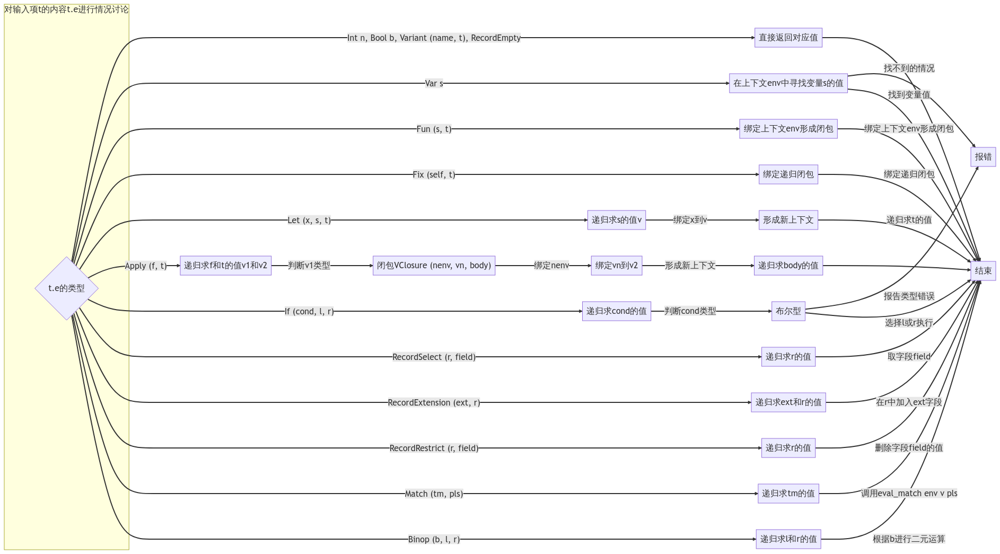
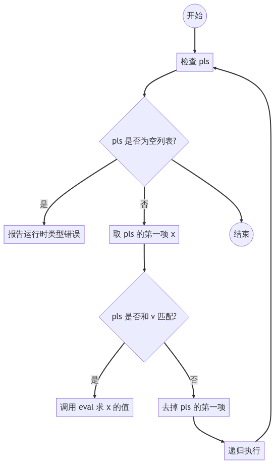
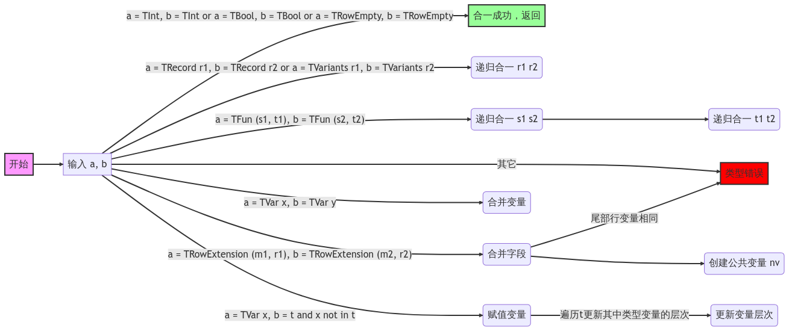
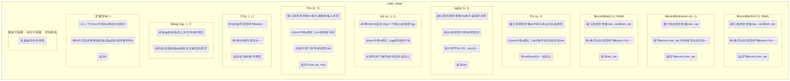
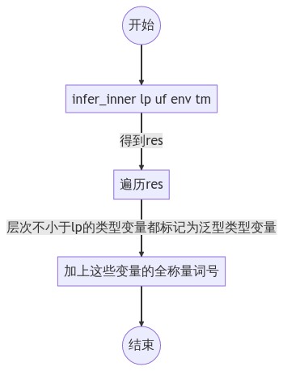
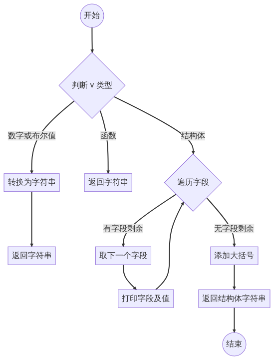
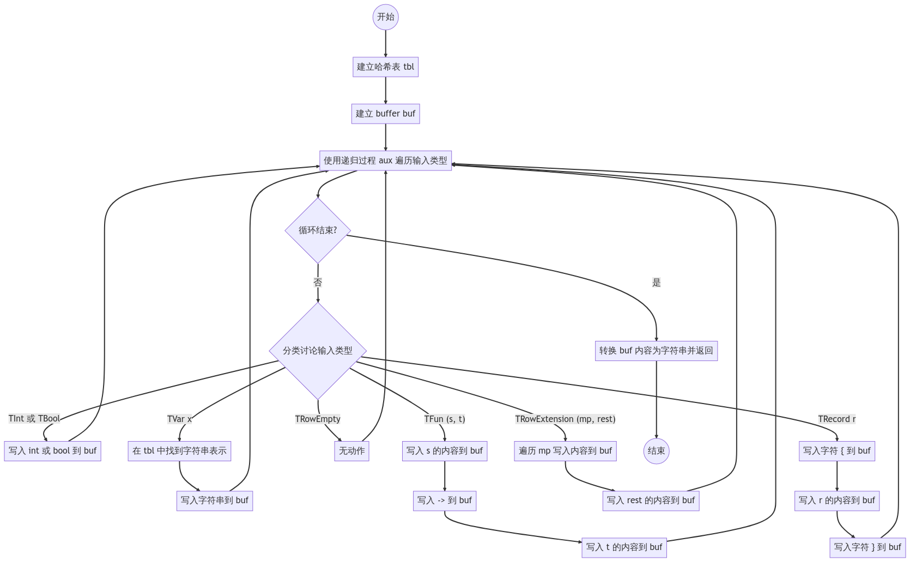

# 详细设计说明书
## 1 引言
### 1.1 编写目的
本文档的目的为制定软件详细的需求规格说明，以支持项目的后续开发。

本文档的主要预期读者为项目组开发人员，以及期望对软件做出贡献者。

### 1.2 背景
这里待开发的软件系统名为可扩展函数式程序设计语言 Merde。

本项目为湛忠胜所提出，开发者为湛忠胜、叶文、郭明昊。该软件在个人笔记本电脑上实现。

### 1.3 定义

### 1.4 参考资料
1. 软件需求说明书
2. 概要设计说明书
3. 测试计划

## 2 程序系统的结构


（这里词法分析直接用`ocamllex`生成，语法分析直接用 canonical LR(1) parser generator `menhir`生成，所以没法提供详细设计细节）

## 3 求值（eval）设计说明
### 3.1 程序描述
本子程序用途为求给定 Merde 表达式的值，是解释器之核心。

### 3.2 功能
本程序输入求值上下文（全局变量和局部变量的绑定）和一个表达式，在该上下文下根据 Merde 语言的操作语义求出该表达式的值，将这个值返回（输出）。

### 3.3 性能
作为图灵完备语言的解释器其可能运行的时间是可以任意长的，所以无法对性能做出要求。

### 3.4 输入项
1. 输入项`env`表示求值的上下文，类型为`Syntax.value Syntax.Env.t`
2. 输入项`t`表示要求值的表达式，类型为`Syntax.term`

### 3.5 输出项
输出项仅有一个且类型为`Syntax.value`，表示求得的值

### 3.6 算法
我们对于输入项`t`的内容`t.e`分情况讨论：
1. 若为`Int n`或者`Bool b`或者`Variant (name, t)`或者`RecordEmpty`，那么已经是字面量了，可以直接返回对应值。
2. 若为`Var s`，则我们在上下文`env`中寻找变量`s`的值并返回，找不到的情况报错。
3. 若为`Fun (s, t)`，那么我们只需要在其基础上绑定上下文`env`形成一个闭包返回。
4. 若为`Fix (self, t)`，那么只需要在`env`上绑定相关的递归闭包形成新的上下文，在新上下文里递归的解释`t`即可。
5. 若为`Let (x, s, t)`，那么在`env`上下文基础上递归求出`s`的值`v`，在`env`上绑定`x`到`v`形成新上下文，在新上下文内递归求出`t`的值。
6. 若为`Apply (f, t)`，那么我们先后递归求出`f`和`t`的值`v1`和`v2`，这里`v1`一定是闭包`VClosure (nenv, vn, body)`的形式（不然则报告运行时类型错误），在`nenv`上绑定`vn`到`v2`形成新上下文，在新上下文内递归求`body`的值。
7. 若为`If (cond, l, r)`，那么我们递归求出`cond`的值，其必须是布尔型（不然报告运行时类型错误），根据其真伪选择`l`或`r`递归执行。
8. 若为`RecordSelect (r, field)`的形式，只需要递归求`r`的值然后在其中取字段`field`即可。
9. 若为`RecordExtension (ext, r)`的形式，那么只需递归求出`ext`和`r`中各表达式值然后在`r`基础上加入`ext`中各字段即可。
10. 若为`RecordRestrict (r, field)`的形式，那么只需要递归求`r`的值然后再其中删除`field`字段的一个值即可。
11. 若为`Match (tm, pls)`的形式，那么递归求出`tm`的值`v`，调用`eval_match env v pls`。
12. 若为`Binop (b, l, r)`，那么先递归求出`l`和`r`的值，然后根据`b`指示的二元运算进行运算即可。

### 3.7 流程逻辑


### 3.8 接口
本子程序隶属`Interpret`模块（也即解释模块），暴露接口为：
```ocaml
val eval : Syntax.value Syntax.Env.t -> Syntax.term -> Syntax.value
(** [eval env tm] 在上下文 [env] 中解释程序 [tm]，成功则返回求得值，
    失败则用异常的形式报错 *)
```

### 3.9 存储分配
难以准确确定。

### 3.10 注释设计
暂无。

### 3.11 限制条件
暂无。

### 3.12 测试计划
见《测试计划》中标识符为`untyped`的部分。

### 3.13 尚未解决的问题
暂无。

## 4 模式匹配求解器（eval_match）设计说明
### 4.1 程序描述
本子程序是`eval`子程序的辅助，用于确定模式匹配中哪一种情况应该匹配上，并根据这个情况求值。

### 4.2 功能
本子程序输入求值上下文、一个值以及一组模式组成的列表，逐一检查列表中哪一个可以匹配上输入值，找到第一个满足这一条件的模式就对其求值，找不到则报告错误。

### 4.3 性能
寻找匹配的过程是线性的，但是求值的时间可以任意长。

### 4.4 输入项
1. `env`：求值上下文，类型为`Syntax.value Syntax.Env.t`
2. `v`：要匹配的值，类型为`Syntax.value`
3. `pls`：模式列表，类型为`(Syntax.pattern * Syntax.term) list`

### 4.5 输出项
输出项仅有一个且类型为`Syntax.value`，表示匹配成功后求得的值

### 4.6 算法
我们检查`pls`：
1. 若`pls`为空列表，说明所有模式都匹配不上，报告运行时类型错误。
2. 否则，取`pls`的第一项`x`，检查`pls`是否和`v`匹配的上，是的话匹配成功，调用`eval`求`x`对应的值。否则，去掉`pls`第一项，递归执行。

### 4.7 流程逻辑


### 4.8 接口
本子程序隶属`Interpret`模块（也即解释模块），不对外暴露接口。

### 4.9 存储分配
难以准确确定。

### 4.10 注释设计
暂无。

### 4.11 限制条件
暂无。

### 4.12 测试计划
见《测试计划》中标识符为`untyped`的部分。

### 4.13 尚未解决的问题
暂无。

## 5 合一（unify）设计说明
### 5.1 程序描述
本子程序的目的，是对于给定的约束，寻找其最一般替换（也就对应了最优的类型推导结果）。但是出于提高效率的考量，最一般代换用并查集的形式表述，合一的操作都在并查集上进行。

### 5.2 功能
本子程序输入一个并查集`uf`、推导层次`lb`以及两个类型`a`和`b`（表示本次执行的约束为`a`等于`b`），然后尝试求解给定的约束，将约束对应最一般代换在`uf`上执行，返回值为`()`（若出错会用异常的形式报错）。

### 5.3 性能
时间复杂度为指数级。

### 5.4 输入项
1. `lb`：推导层次，类型为`int`
2. `uf`：操作的并查集，类型为`Utils.Unionfind.t`
3. `a`和`b`：要合一的两 Merde 类型，类型都为`Syntax.ty`

### 5.5 输出项
只输出一个`()`。

### 5.6 算法
对`a`和`b`分情况讨论：
1. 若二者都为`TInt`或都为`TBool`或都为`TRowEmpty`，则合一成功，直接返回。
2. 若二者为`TRecord r1, TRecord r2`或为`TVariants r1, TVariants r2`，则递归的合一`r1`和`r2`。
3. 若二者为`TFun (s1, t1), TFun (s2, t2)`，则递归合一`s1`和`s2`，再递归合一`t1`和`t2`。
4. 若二者形如`TRowExtension (m1, r1), TRowExtension (m2, r2)`，则先检查二者尾部是否是同样的行变量，是的话直接报告类型错误。否则先对于`m1`和`m2`共有的字段的内容一一递归合一，然后建立新变量`nv`表示`r1`和`r2`的公共部分，输出新约束。
5. 若二者形如`TVar x, TVar y`，那么在并查集上将对应的变量合并。
6. 若二者一个为`TVar x`但另一个为其他的（实在）类型`t`且类型变量`x`在`t`中未有自由出现，那么检查并查集中`x`对应集合是否有内容，有的话将这内容与`t`递归合一，否则将`x`对应集合赋予内容`t`（注意此时还需要遍历`t`更新其中类型变量的层次）。
7. 其他情况的话都是类型错误，报错。

### 5.7 流程逻辑


### 5.8 接口
本子程序隶属`Reconstruction`模块（也即双向类型检查模块），不对外暴露接口。

### 5.9 存储分配
难以准确确定。

### 5.10 注释设计
暂无。

### 5.11 限制条件
暂无。

### 5.12 测试计划
见《测试计划》中标识符为`test_infer`的部分。

### 5.13 尚未解决的问题
暂无。

## 6 类型推导（infer）设计说明
### 6.1 程序描述
本子程序的用途是对于特定层次、类型上下文和给定创建好的并查集，推导出一个项的类型。

### 6.2 功能
输入推导层次、类型上下文、并查集、一个项，递归的生成这个项的约束，将约束用合一求解，最终根据合一操作后的并查集输出推导后类型。

### 6.3 性能
时间复杂度为指数级别。

### 6.4 输入项
1. `lp`：推导层次，类型为`int`
2. `uf`：并查集，类型为`Utils.Unionfind.t`
3. `env`：类型上下文，类型为`Syntax.poly_ty Syntax.Env.t`
4. `tm`：输入项，类型为`Syntax.term`

### 6.5 输出项
返回推导出的最优类型，类型为`Syntax.poly_ty`

### 6.6 算法
我们需要定义一个内部递归过程`infer_inner`，其接受的输入项同`infer`（见6.4节），输出项类型为`Syntax.ty`。其过程为根据`tm.e`分类讨论（这里的推导除非特别表明，都是指递归调用`infer_inner`）：
1. 若为数值字面量、布尔字面量、空结构体，则直接返回对应类型。
2. 若为变量型`Var s`，那么我们在上下文`env`中找到`s`绑定的类型`tt`（找不到的情况报错），将`tt`中泛型的变量都代换成`lp`层的新变量得到`t`，返回`t`.
3. 若为`Binop (op, l, r)`，那么根据`op`的实际意义决定`l`和`r`的类型（也就是将`l`和`r`的递归推导结果和`op`输入类型合一），返回值也是根据`op`实际意义确定的类型。
4. 若为`If (b, l, r)`，则要将`b`的推导类型和`TBool`合一，将`l`和`r`的推导类型合一，返回值为`l`的推导类型。
5. 若为`Fun (x, t)`，则建立新类型变量`nv`表示这个函数的输入类型，在`env`中将`x`绑定上`nv`得到新环境，在新环境下推导`t`的类型`res`，返回`TFun (nv, res)`。
6. 若为`Let (x, s, t)`，那么调用`infer`在新层次`lp+1`下推出`s`的类型`typ`，在`env`中将`x`绑定上`typ`得到新环境，在新环境下推导`t`的类型并返回之。
7. 若为`Apply (s, t)`，则建立新的类型变量`res`表示返回的类型，推出`s`的类型`t1`和`t`的类型`t2`，将`t1`和`TFun (t2, res)`合一，然后返回`res`。
8. 若为`Fix (x, t)`，则建立新类型变量`self`表示表达式自身类型，然后在`env`中将`x`绑定上`self`推导`t`的实际类型`res`，将`res`和`self`合一，返回之。
9. 若为`RecordSelect (r, field)`，则建立新类型变量`row_var`和`ret_var`，那么我们希望`r`的类型就是`TRecord rr`（这里`rr`是指在`row_var`基础上加入`field : ret_var`），也就是要将`r`推导出的类型和这个类型合一，最终的返回值为`ret_var`。
10. 若为`RecordExtension (m, r)`，则建立新的类型变量`row_var`，将`TRecord row_var`与`r`的推导出类型合一，最后返回值就是在`TRecord row_var`基础上扩充进`m`的每个字段的类型。
11. 若为`RecordRestrict (r, field)`，则建立新类型变量`row_var`和`ret_var`，那么我们希望`r`的类型就是`TRecord rr`（这里`rr`是指在`row_var`基础上加入`field : ret_var`），也就是要将`r`推导出的类型和这个类型合一，最终返回值为`TRecord row_var`。

回到主过程`infer`来，我们先调用`infer_inner lp uf env tm`得到一个没有标记泛型全称量词的类型`res`，然后遍历`res`，将其中所有层次不小于`lp`的类型变量都标记为泛型类型变量，最终在`res`的基础上加上这些变量的全称量词号即可返回。

### 6.7 流程逻辑




### 6.8 接口
本子程序隶属`Reconstruction`模块（也即双向类型检查模块），不直接对外暴露接口。相反，我们封装了一个函数（自动的创立一个并查集，并将初始的推导层次设为$0$来调用`infer`）来方便其他模块使用：
```ocaml
let reconstruct_toplevel env t = infer 0 (Utils.Unionfind.init 1 (fun x -> `TVar (0, x))) env t
```
这一函数的接口为：
```ocaml
val reconstruct_toplevel :
  Syntax.poly_ty Syntax.Env.t -> Syntax.term -> Syntax.poly_ty
(** [reconstrct env tm] 在 [env] 这个类型上下文里对表达式 [tm] 进行推导，
    给出最优解，出错的情况下通过异常报错 *)
```

### 6.9 存储分配
难以准确确定。

### 6.10 注释设计
暂无。

### 6.11 限制条件
暂无。

### 6.12 测试计划
见《测试计划》中标识符为`test_infer`的部分。

### 6.13 尚未解决的问题
暂无。

## 7 值输出（string_of_value）设计说明
### 7.1 程序描述
本子程序用于将一个值转换成字符串输出。

### 7.2 功能
该程序输入为一个 Merde 值，将之转换成字符串输出。

### 7.3 性能
时间复杂度为线性级别。

### 7.4 输入项
输入项仅有一个`v`，类型为`value`。

### 7.5 输出项
输出项为一个字符串。

### 7.6 算法
对`v`分类讨论：
1. 若为数字或者布尔值则直接转换成字符串返回。
2. 若为函数则只返回一个字符串`"<fun>"`。
3. 若为结构体，则挨个打印其各个字段及这个字段的值，最后还要在两边加上大括号后返回。

### 7.7 流程逻辑


### 7.8 接口
本子程序隶属于`Syntax`模块，对外暴露接口为：
```ocaml
val string_of_value : value -> string
(** 将值转为字符串以显示给用户 *)
```

### 7.9 存储分配
难以准确确定。

### 7.10 注释设计
暂无。

### 7.11 限制条件
暂无。

### 7.12 测试计划
见《测试计划》中标识符为`combine_parser`的部分。

### 7.13 尚未解决的问题
暂无。

## 8 类型输出（string_of_polytype）设计说明
### 8.1 程序描述
本子程序用于将一个可能带有泛型的类型转换成字符串输出。

### 8.2 功能
该程序输入为一个 Merde 多态类型，将之转换成字符串输出。

### 8.3 性能
时间复杂度为线性级别。

### 8.4 输入项
输入项仅有一个`t`，类型为`poly_ty`。

### 8.5 输出项
输出项为一个字符串。

### 8.6 算法
为了让用户感觉更直观，我们要把泛型类型变量显示成`'a, 'b, 'c, ...`这样的形式。因此第一步就是先建立一个哈希表`tbl`，将所有泛型类型变量绑定成这种单个撇号加字母的形式。此外建立一个buffer`buf`，用来存放输出结果。

接下来用一个内部递归过程`aux`遍历输入类型，其内容是对输入类型的分类讨论：
1. 若输入类型为`TInt`或`TBool`，则直接向`buf`写入`int`或`bool`。
2. 若为`TVar x`，则在`tbl`中找到其字符串表示，写入`buf`。
3. 若为`TFun (s, t)`，则先向`buf`写入`s`的内容（如果`s`本身是个复杂类型那么还要在其两端加上括号以免混淆），然后写入字符串` -> `，最后写入`t`的内容。
4. 若为`TRowEmpty`，则无动作。
5. 若为`TRowExtension (mp, rest)`，则先遍历`mp`将其内容写入`buf`，再将`rest`的内容写入。
6. 若为`TRecord r`，则先向`buf`写入字符`{`，然后写入`r`的内容，最后写入字符`}`。

以上遍历完成后，将`buf`内容转成字符串返回即可。

### 8.7 流程逻辑


### 8.8 接口
本子程序隶属于`Syntax`模块，对外暴露接口为：
```ocaml
val string_of_polytype : poly_ty -> string
(** 将有泛型的类型转换成字符串显示给用户 *)
```

### 8.9 存储分配
难以准确确定。

### 8.10 注释设计
暂无。

### 8.11 限制条件
暂无。

### 8.12 测试计划
见《测试计划》中标识符为`combine_parser`的部分。

### 8.13 尚未解决的问题
暂无。