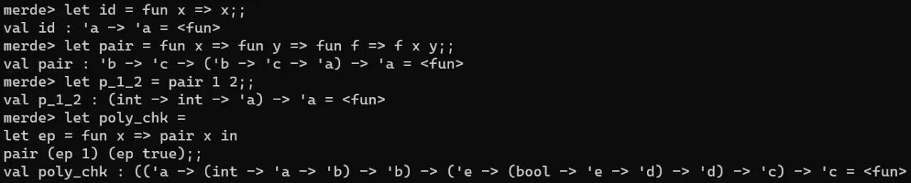

## 工作分配与协作

在这个项目中，我们按照分工合作的原则开展工作。

- 湛忠胜同学负责语言设计及代码实现，包括类型系统的设计和实现等
- 郭明昊同学负责文档、PPT的制作以及部分的代码实现优化
- 叶文同学负责编写测试用例以及部分代码编写

使用 GitHub 进行代码管理和版本控制，并在每次代码提交后进行相应的讨论和审核。保持良好的沟通协作，及时交流并解决问题。

## 项目进展情况

在这个阶段，我们已经完成了 merde 语言的词法分析、语法分析、类型推导和基本的解释器实现。同时，我们也已经实现了一些基本的语言特性，比如高阶函数、let 绑定。

在具体实现过程中，我们深入研究了 Hindley-Milner 类型系统和 row polymorphism 扩展，并成功将其应用到了 merde 语言的类型系统中。并查集数据结构的使用也使得我们能够更高效地进行类型推导。

另外，我们也编写了基本的测试用例，覆盖了 merde 语言的主要语法和类型系统特性，并完成了部分优化工作。

## 下一步工作计划

接下来我们将继续完善 merde 语言的实现，主要包括以下几方面：

- 完成编译器的实现，将 merde 语言翻译成某一种 IR。
- 实现更多的语言特性，比如模块化、异常处理等。
- 对代码进行更深入的优化工作，提高程序运行效率。
- 完善测试用例和文档，确保程序质量和可读性。
- 我们会按照以上计划，不断迭代改进 merde 语言的实现，并尽可能满足更多的用户需求。